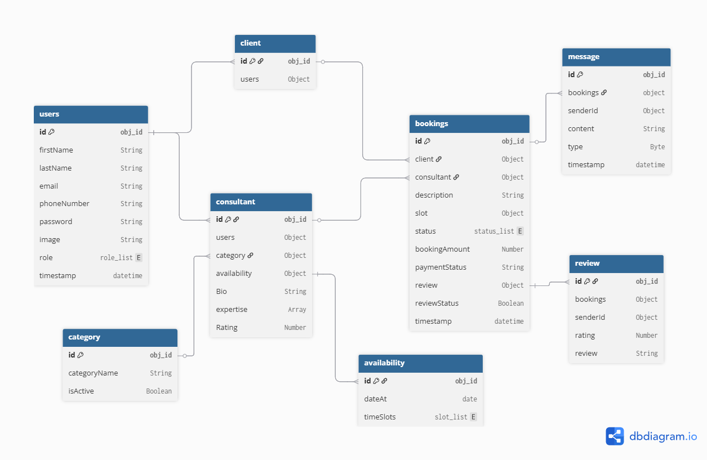

  <h1>TrustConsult</h1>
  <h2> A Full Stack Online Consulting Platform </h2>
  <h3> Check out at https://trust-consult.vercel.app</h3>
  
A full-stack consultancy platform enabling clients to connect with trusted experts via real-time chat, video calling, and secure online payments.

 

<h2>Table of Contents</h2>

- [Project Description](#project-description)
- [Technology Used](#tech-stack)
  - [Frontend](#frontend)
  - [Backend](#backend)
- [Data Models and Database Schema](#data-models-and-database-schema)
- [API Design](#api-design)
## Project Description

*TrustConsult is a scalable real-time consulting platform designed to help clients connect with trusted domain experts through chat and live video sessions. The application is built using the Next.js App Router and follows a modular architectural pattern, optimizing both performance and maintainability. Authentication is implemented with JWT and bcrypt to ensure secure onboarding, access control, and private communication.

*To enable real-time communication, the system uses Firebase Firestore for message storage and Firebase Realtime Database for user presence awareness. Live video consultations are powered by WebRTC, enabling peer-to-peer streaming with TURN/STUN fallback support for complex network environments. Stripe Checkout is integrated to support secure, smooth payment processing for consultation sessions.

*The platform features a responsive and modern user interface built with Tailwind CSS, offering a clean and intuitive experience across devices. Deployment is managed through Vercel for frontend edge delivery and Render for required backend operations, ensuring a globally performant and highly available system.

## 📌 Technology Used

### Frontend

       

-**HTML5 →** Base structure and semantic markup for accessibility

-**CSS3 / Tailwind CSS →** Responsive, utility-first design system

-**JavaScript (ES6+) →** Interactive frontend logic

-**React.js →** Component-based UI architecture

-**Next.js (App Router) →** Server-side rendering (SSR), routing, metadata SEO

### Backend / Server

   

-**Node.js →** Backend runtime for scalable application logic
-**Firebase →** Used for realtime chat and video call.

### Real-time & Database

  

-**Firebase Firestore →** Stores messages and call documents

-**Firebase Realtime Database →** Live presence system (online/offline tracking)

-**Cloudinary →** Image upload for chat messages

### Communication Layer

  

-**WebRTC →** Peer-to-peer video/audio streaming

-**TURN/STUN servers →** NAT traversal for reliable calling

### Payment Integration

  

-**Stripe Checkout →** Secure payment, subscription/session verification

### Deployment

 

-**Vercel →** Frontend hosting with serverless functions

### Data Models and Database Schema:

The back end of TrustConsult uses a range of data models and database schemas to
manage data, including:
1. Client schema: Includes fields such as name, email, password
2. Instructor schema: Includes fields such as name, email, password, and course
details for each instructor.
3. Booking schema: Includes fields such as client Id, consultant Id , description, slot details,
and rating.

(<a href="#top">back to top</a>)

